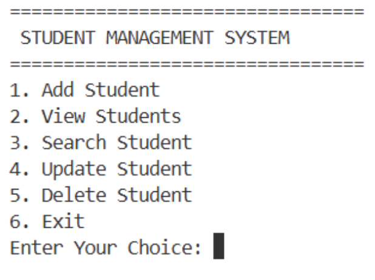
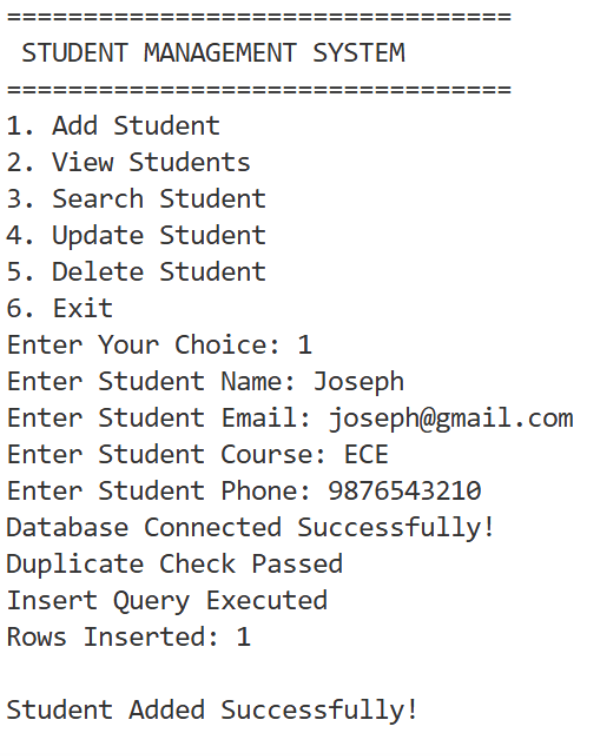
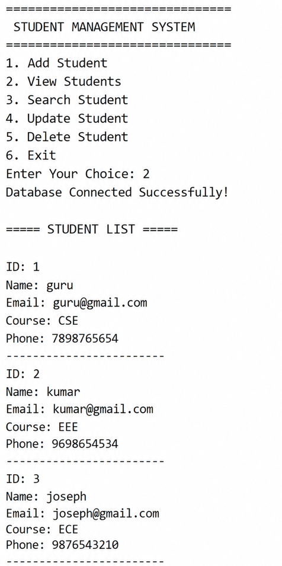
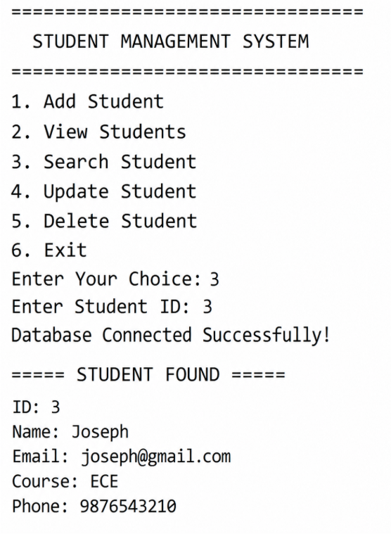
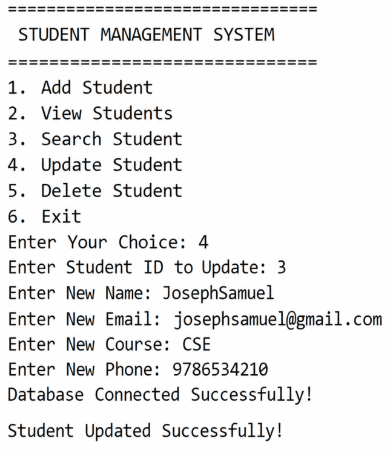
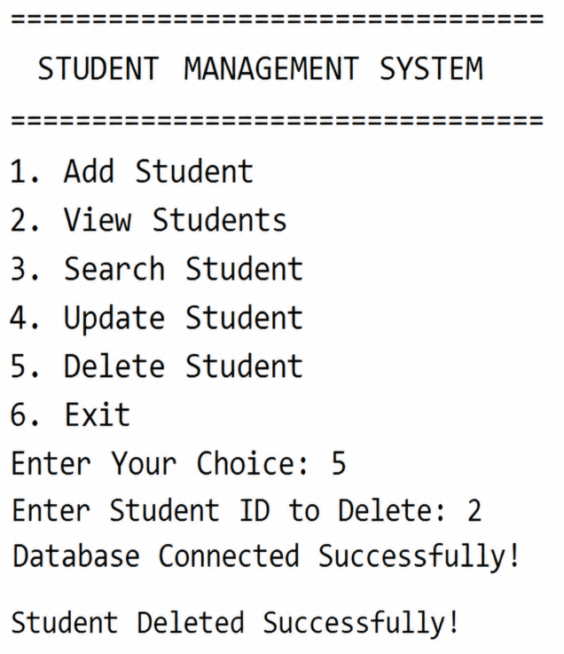
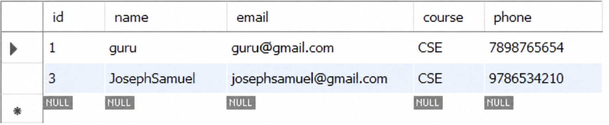

<h1 align="center">🎓 Student Management System</h1>

<h3 align="center">
Java + JDBC + MySQL CRUD Application 🚀
</h3>

<p align="center">


</p>

---

<p align="center">


</p>

---

<p align="center">


</p>

---

# 🚀 About Project

A professional **console-based Student Management System** built using:

✅ Java  
✅ JDBC  
✅ MySQL  
✅ Object-Oriented Programming  
✅ DAO Design Pattern  

This project performs complete CRUD operations with validation and database integration.

---

# ✨ Features

<div align="center">

| Feature | Status |
|----------|--------|
| Add Student | ✅ |
| View Students | ✅ |
| Search Student | ✅ |
| Update Student | ✅ |
| Delete Student | ✅ |
| Email Validation | ✅ |
| Phone Validation | ✅ |
| Duplicate Email Prevention | ✅ |
| Loop Menu System | ✅ |
| JDBC Connectivity | ✅ |

</div>

---

# 🛠️ Tech Stack

<p align="center">


</p>

---

# 🎞️ Tech Stack

<p align="center">


</p>

<p align="center">


</p>

---

# 📂 Project Structure

```bash
StudentManagementSystem
│
├── lib
├── src
│   ├── dao
│   ├── db
│   ├── model
│   ├── ui
│   └── App.java
│
├── screenshots
├── README.md
└── .gitignore
```

---

# 🗄️ Database Configuration

## Database Name

```sql
student_management_system
```

## Table Name

```sql
students
```

---

# ⚡ How To Run

## 1️⃣ Clone Repository

```bash
git clone https://github.com/codefuser/student-management-system-java.git
```

---

## 2️⃣ Open Project

Open project in VS Code.

---

## 3️⃣ Compile Project

```bash
javac -cp ".;../lib/mysql-connector-j-9.7.0.jar" App.java
```

---

## 4️⃣ Run Project

```bash
java -cp ".;../lib/mysql-connector-j-9.7.0.jar" App
```

---

# 📸 Project Screenshots

---

## 🖥️ Main Menu

<p align="center">

</p>

---

## ➕ Add Student

<p align="center">

</p>

---

## 📋 View Students

<p align="center">

</p>

---

## 🔍 Search Student

<p align="center">

</p>

---

## ✏️ Update Student

<p align="center">

</p>

---

## ❌ Delete Student

<p align="center">

</p>

---

## 🗄️ MySQL Database

<p align="center">

</p>

---

# 📚 Concepts Used

<div align="center">

| Concept | Used |
|----------|------|
| OOP Concepts | ✅ |
| DAO Pattern | ✅ |
| JDBC Connectivity | ✅ |
| PreparedStatement | ✅ |
| ResultSet | ✅ |
| CRUD Operations | ✅ |
| Validation Logic | ✅ |
| Exception Handling | ✅ |

</div>

---

# 🌟 Support This Project

<p align="center">


</p>

---

# ❤️ Give Support

<p align="center">

<a href="https://github.com/codefuser/student-management-system-java">

</a>

<a href="https://github.com/codefuser/student-management-system-java/fork">

</a>

</p>

---

# 🌐 Connect With Me

<p align="center">

<a href="https://github.com/codefuser">

</a>

<a href="https://www.linkedin.com/in/joseph-fullstack/">

</a>

</p>

---

# 🚀 Future Improvements

🔹 Swing GUI  
🔹 JavaFX UI  
🔹 Login System  
🔹 Admin Dashboard  
🔹 CSV Export  
🔹 File Handling  
🔹 Authentication System  

---

# 👨‍💻 Author

<h3 align="center">Joseph</h3>

<p align="center">


</p>

---

<h2 align="center">
🔥 Thank You For Visiting My Project 🔥
</h2>

<p align="center">


</p>